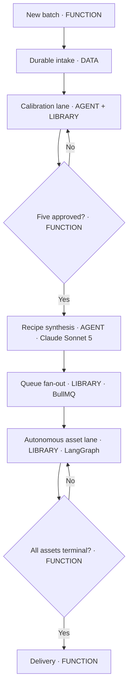
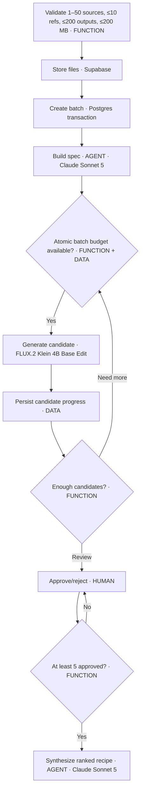
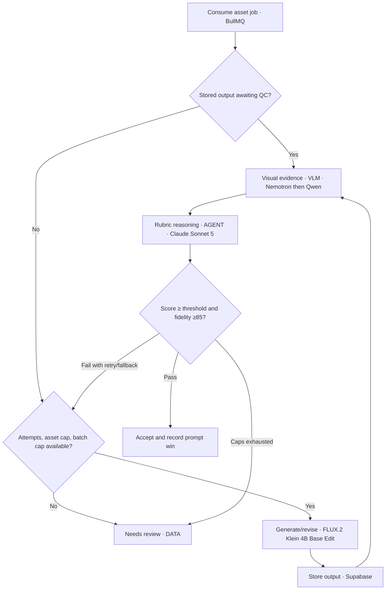

# Creative QC Agent — Architecture Flow

Framewise has one human calibration gate and one bounded autonomous lane. Claude owns structured reasoning, fal/OpenRouter VLMs extract visual evidence, fal.ai FLUX owns rendering, and deterministic functions own validation, thresholds, budgets, and state transitions. Postgres, object storage, and BullMQ make every expensive boundary durable.

## Master flow

## Calibration and recipe

## Autonomous asset loop

## Gates at a glance

| Gate | Default | Enforcer |
|---|---:|---|
| Sources / references | 1–50 / 0–10 | API validation before storage |
| Output expansion | sources × ratios × variants, maximum 200 | client estimate plus server validation |
| Combined upload | 200 MB files; 205 MB early transport guard | content-length guard plus post-parse file validation |
| Aspect ratio | exact selected ratio on every output row | deterministic fal image-size mapping |
| Calibration approvals | 5 | approval state plus synthesis guard |
| QC pass | 80/100 blended and product fidelity ≥85 | LangGraph decision function |
| Feedback retries | 2 per prompt | LangGraph state |
| Total attempts | 5 per asset | LangGraph state |
| Per-call generation estimate | $0.018 with source only; +$0.009 per supplied reference, up to $0.045 | deterministic input-aware pre-call reservation |
| Per-asset generation spend | $0.50 | deterministic pre-call check |
| Batch spend | UI cap, default $5 | atomic conditional Postgres update |
| Delivery | 25 MB/image, 250 MB total | export fetch/ZIP guard |
| Live readiness | actual DB, Redis, Storage, Anthropic model, fal VLM endpoint, and fal generation probes | startup preflight plus cached health endpoint |

## File index

| Stage | Primary files |
|---|---|
| Product contract and validation | `src/lib/types.ts`, `src/lib/validation.ts` |
| Intake and storage | `src/app/api/batches/route.ts`, `src/lib/storage.ts` |
| Reasoning agents | `src/lib/providers/anthropic.ts` |
| Visual evidence | `src/lib/providers/vlm.ts` |
| Image generation | `src/lib/providers/fal.ts` |
| Autonomous state machine | `src/lib/orchestrator/graph.ts` |
| Persistence and atomic spend | `src/lib/repository.ts`, `src/lib/db/schema.ts` |
| Queue and worker | `src/lib/queue.ts`, `worker/index.ts` |
| Delivery | `src/app/api/batches/[id]/delivery/route.ts` |
| User experience | `src/app`, `src/components` |

Canonical source diagrams live in `docs/mermaid/`. The standalone viewer is `docs/architecture-flow.html`.
